<div align="center">

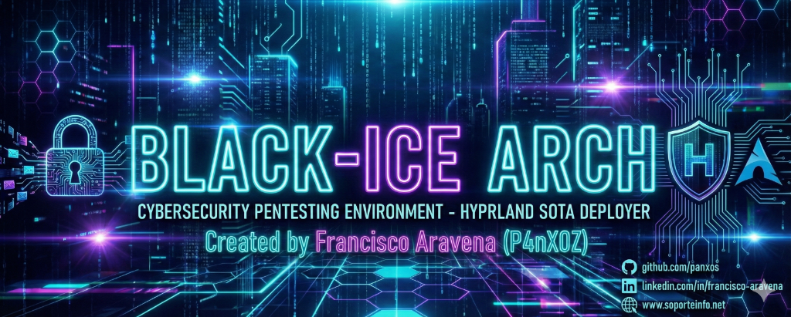

# 🧊 BLACK-ICE ARCH

### Automated Arch Linux Installation with Hyprland & Cybersecurity Tools

[](LICENSE)
[](https://archlinux.org/)
[](https://hyprland.org/)
[](https://github.com/panxos/BLACK-ICE-HYPER_ARCH)

**[🇪🇸 Español](README.md) | 🇬🇧 English**

---

### 🚀 One-Command Installation

```bash
curl -L http://is.gd/blackice | bash
```

</div>

---

## 📋 Table of Contents

- [Overview](#-overview)
- [Two-Phase Architecture](#-two-phase-architecture)
- [Features — Phase 1: Base System](#-features--phase-1-base-system)
- [Features — Phase 2: Desktop Environment](#-features--phase-2-desktop-environment)
- [Security Tools](#-security-tools)
- [Waybar Themes](#-waybar-themes-21-themes)
- [Desktop Gallery](#️-desktop-gallery)
- [System Requirements](#-system-requirements)
- [Quick Install](#-quick-install)
- [Manual Installation](#-manual-installation)
- [Unattended Configuration](#-unattended-configuration)
- [Keyboard Shortcuts](#️-keyboard-shortcuts)
- [Customization](#-customization)
- [Troubleshooting](#-troubleshooting)
- [Repository Structure](#-repository-structure)
- [Documentation](#-documentation)
- [Credits](#-credits)
- [License](#-license)

---

## 🎯 Overview

**BLACK-ICE ARCH** is a two-phase automated deployment system for Arch Linux, specifically designed for **Cybersecurity Professionals** and **Penetration Testers**. It transforms a minimal Arch Linux ISO into a fully configured, hardened Hyprland workstation ready for security audits.

### Why BLACK-ICE ARCH?

- ⚡ **One-command installation** from the LiveCD
- 🎨 **Cyberpunk aesthetic** with 21 live-switchable Waybar themes
- 🛡️ **100+ security tools** organized in 10 categories
- 🔒 **Full LUKS2 encryption** supported from the base install
- 🚀 **Automatic hardware detection** — CPU, GPU, virtualization
- 🤖 **Integrated AI tools** — Claude Code, Gemini CLI
- 📦 **Fully automated** with unattended mode available

---

## 🏗️ Two-Phase Architecture

```
ARCH LINUX ISO (LiveCD)
        │
        ▼
┌─────────────────────────────────────────┐
│  PHASE 1 — install.sh                   │
│  src/modules/ (00→06, 99)               │
│  Base system, disk, encryption, kernel  │
│  → First reboot                         │
└─────────────────────────────────────────┘
        │
        ▼
┌─────────────────────────────────────────┐
│  PHASE 2 — deploy_hyprland.sh           │
│  src/deploy/ (00→09, 99)                │
│  Desktop environment, tools,            │
│  themes, AI, dotfiles                   │
└─────────────────────────────────────────┘
```

---

## ⚙️ Features — Phase 1: Base System

### Disk Detection and Partitioning

- Full support: SATA (`/dev/sdX`), NVMe, VirtIO (KVM), Xen, eMMC
- Automatic UEFI/BIOS boot mode detection and partitioning
- **LUKS2** full-disk encryption with PBKDF2 — passphrase requested interactively from `/dev/tty`
- Supported filesystems: **btrfs** (with snapshots), **ext4**, **xfs**, **f2fs**

### Kernel and Microcode

- Interactive kernel selection: `linux`, `linux-zen` (gaming/performance), `linux-hardened` (security)
- Auto-detected CPU vendor Intel/AMD → installs `intel-ucode` or `amd-ucode` automatically

### System Configuration

- Configurable locale, timezone, hostname and keyboard layout
- User creation with credential validation
- GRUB with LUKS support + **DedSec theme** (Watch Dogs style)
- Automatic recovery mode if a previous BLACK-ICE installation is detected

### Power Management

- Automatic environment detection: Laptop → TLP + dynamic profiles, Desktop/VM → CPUpower performance
- NVMe APST, thermald (Intel physical), lm_sensors, acpid

---

## 🖥️ Features — Phase 2: Desktop Environment

### Compositor and Desktop

- **Hyprland v0.54+** — Wayland compositor with smooth animations, multi-monitor and multi-workspace support
- **Waybar** — fully customizable status bar with 21 cyberpunk themes
- **SDDM** — display manager with custom CyberSec theme
- **Kitty** — GPU-accelerated terminal with 21 color schemes coordinated with Waybar themes
- **Wofi** — Wayland app launcher with 4 switchable styles (`Super+Alt+R`)
- **SwayNC** — notification center with dark theme
- **wlogout** — session menu with fadeIn animations and hover glow

### Shells and Terminal

- **Zsh** + Oh-My-Zsh + **Powerlevel10k** with custom SSH server segment
- **fzf-tab** — interactive tab completion with previews (ls, bat, kill)
- Modern aliases: `lsd` (ls), `bat` (cat), xclip integrated
- `tech_quotes.sh` — random technical quotes on terminal open

### Editor

- **Neovim** with **NvChad** + LazyVim + configured LSP
- `git clone --depth=1` for efficient installation

### Music

- **MPD** + **ncmpcpp** — local music player with systemd --user service
- **Eww Music Widget** (`Win+Shift+N`) — floating 380×115px top-right widget with album art, interactive progress bar, prev/play-pause/next controls, shuffle and loop
- Powered by **playerctl/MPRIS**, full cyberpunk CSS

### AUR and Repositories

- **paru** from chaotic-aur (binary compiled against the system's pacman, never breaks after `pacman -Syu`)
- Chaotic-AUR enabled by default
- `safe_install` — resilient helper with ABI mismatch detection and automatic pacman fallback

### Integrated BLACK-ICE Tools

| Script | Shortcut | Description |
|--------|----------|-------------|
| `cheatsheet` | `Super+I` | GTK3 fullscreen overlay with all shortcuts, 3 columns |
| `app_switcher` | `Super+Tab` | Window switcher via Wofi with Nerd Font icons |
| `pass_menu` | `Super+Shift+X` | KeePassXC CLI + Wofi — password/user/TOTP, auto-clears in 30s |
| `terminal_manager` | `Super+Ctrl+Enter` | Multi-tab Kitty sessions (Pentesting/Dev/SOC) |
| `theme_selector` | `Super+Alt+T` | Visual Waybar theme selector with thumbnails |
| `wallpaper_visual` | `Super+Alt+W` | waypaper GUI wallpaper selector |
| `wofi_style_selector` | `Super+Alt+R` | Wofi style selector (4 styles) |
| `wifi_toggle` | `Super+Alt+F` | WiFi toggle via nmcli with swaync notification |
| `power_profile_menu` | `Super+Shift+P` | Power profile menu |
| `gh0stzk-walls` | CLI | Download gh0stzk wallpapers (`--all`, `--theme`, `--list`) |
| `xdg-open-wayland` | auto | xdg-open wrapper for Wayland OAuth (gemini-cli) |
| `docker_menu` / `kvm_menu` | CLI | Docker and KVM management menus via Wofi |
| `htb-connect` / `htb-disconnect` | CLI | HackTheBox VPN integration |

### AI Tools

- **Claude Code CLI** (`@anthropic-ai/claude-code`) — via global npm
- **Gemini CLI** (`@google/gemini-cli`) — via global npm
- Zsh update aliases: `claudeupdate`, `geminiupdate`

### Pywal Integration

- `theme_selector` runs `wal -i <wallpaper> -n` on theme change
- Palette generated from the active wallpaper → applied to Kitty via socket (`kitty @ set-colors`) + SIGUSR1
- 21 manual `.conf` theme files per Waybar theme in `dotfiles/kitty/themes/`

---

## 🛡️ Security Tools

**100+ tools organized in 10 categories, with an interactive whiptail installer:**

| Category | Featured Tools |
|----------|---------------|
| 🔍 **Reconnaissance** | nmap, masscan, rustscan, recon-ng, theHarvester, amass, spiderfoot, sherlock |
| 🌐 **Web Hacking** | burpsuite, zaproxy, sqlmap, nikto, gobuster, ffuf, wfuzz, feroxbuster, wpscan |
| 📡 **Wireless** | aircrack-ng, kismet, wifite, reaver, bully, pixiewps |
| 🪟 **Windows/AD** | impacket, netexec, bloodhound, evil-winrm, certipy, smbmap, neo4j |
| 🔐 **Cracking** | john, hashcat, hydra, medusa, seclists, rockyou |
| 💥 **Exploitation** | metasploit, searchsploit, villain, SET, exploitdb |
| 🕵️ **Sniffing/MITM** | wireshark, tcpdump, ettercap, bettercap, mitmproxy |
| 🔧 **Reverse Engineering** | gdb, radare2, ghidra, apktool, jadx, dex2jar |
| 🔬 **Digital Forensics** | autopsy, volatility3, binwalk, foremost, steghide, stegseek, exiftool |
| 🌐 **Networking/Tunneling** | proxychains, chisel, sshuttle, socat, minicom, snmpcheck |

### Installer Modes

- **Standard Suite** (recommended) — everything without heavy packages, fast install
- **Custom selection** — whiptail checklist, SPACE to toggle, ENTER to confirm
- **Full Suite** — includes bloodhound (~60min), ghidra (~20min), autopsy (~20min)
- **Unattended mode** (`AUTO_MODE=true`) — installs Standard Suite without prompts

---

## 🎨 Waybar Themes (21 Themes)

Switch between themes live with `Super+Alt+T`. The selector automatically updates Waybar, Hyprland borders, Hyprlock colors and the Kitty color palette.

| Theme | Style |
|-------|-------|
| **Horus-Cyber** | Cyberpunk cyan/purple — default theme |
| **H4k3r-HTB** | HackTheBox green, compact pill-right |
| **Matrix-Hacker** | Matrix green rain aesthetic |
| **Jan-CyberPunk** | CyberPunk magenta, floating pills |
| **Janis-CyberMagenta** | Vibrant magenta |
| **s4vitar-darkness** | Dark dual-bar — tribute to s4vitar |
| **Emilia-TokyoNight** | Tokyo Night blue/purple |
| **Marisol-Dracula** | Dracula purple |
| **Isabel-Frappe** | Catppuccin Frappé |
| **Daniela-Catppuccin** | Catppuccin Mocha |
| **Melissa-Nord** | Minimal Nord |
| **Silvia-Gruvbox** | Gruvbox warm |
| **Brenda-Everforest** | Everforest green |
| **Karla-ZombieNight** | ZombieNight dark |
| **Zombie-Decay** | Dark Decay |
| **Pamela-Lovelace** | Lovelace pastel |
| **Varinka-Mono** | Monochrome, boxed modules |
| **Yael-OxoCarbon** | OxoCarbon fullwidth slim |
| **Anubis-Death** | Death black/red |
| **Isis-Magic** | Magic purple/gold |
| **Ra-Solar** | Solar orange/gold |

---

## 🖼️ Desktop Gallery

> Switch themes live with `Super+Alt+T` — visual thumbnail selector

| | | |
|:---:|:---:|:---:|
| 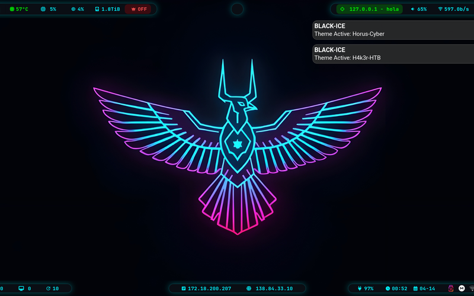 | 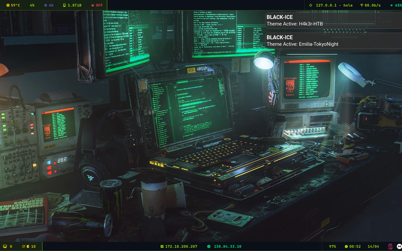 | 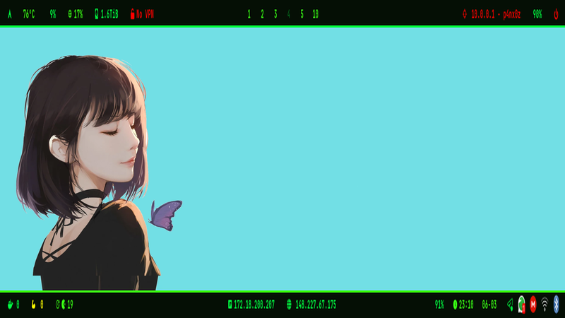 |
| **Horus-Cyber** | **H4k3r-HTB** | **Matrix-Hacker** |
| 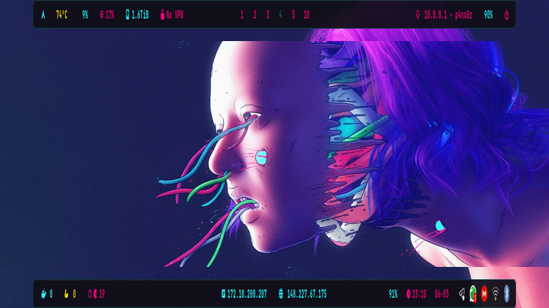 | 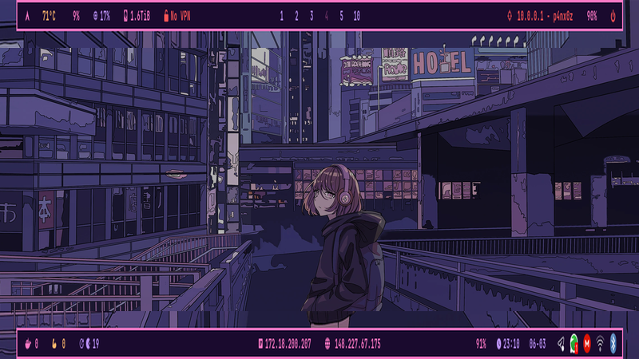 | 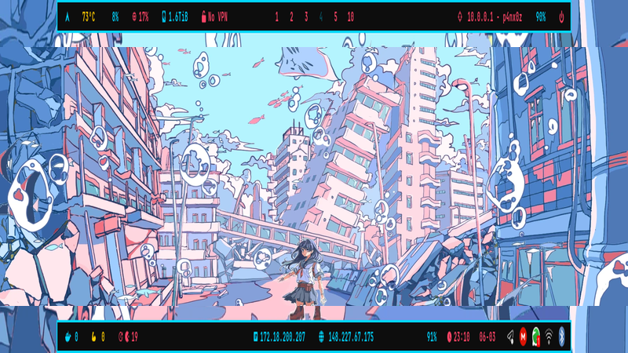 |
| **Jan-CyberPunk** | **Janis-CyberMagenta** | **s4vitar-darkness** |
| 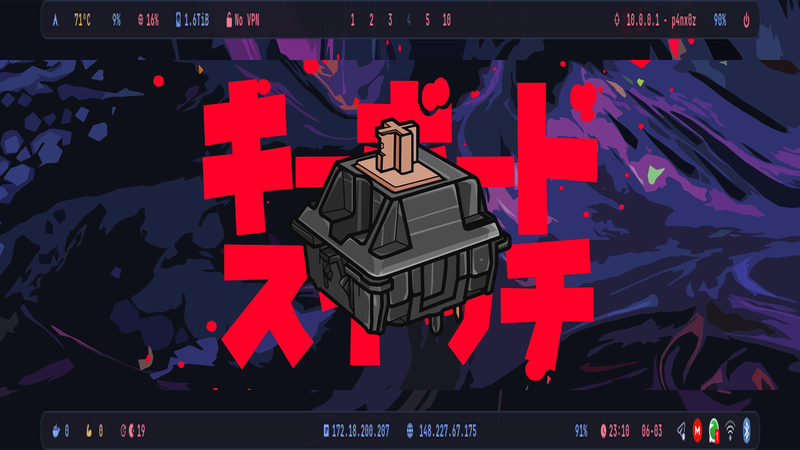 | 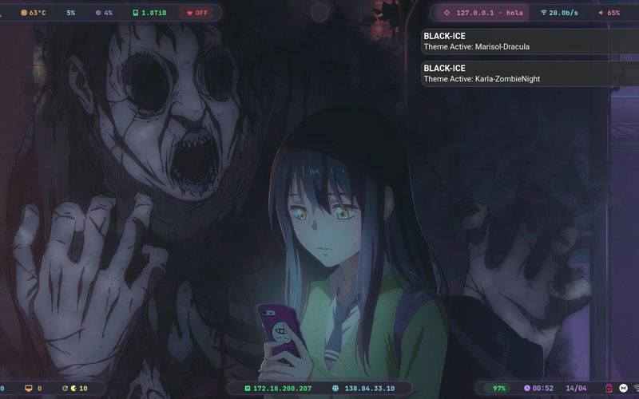 | 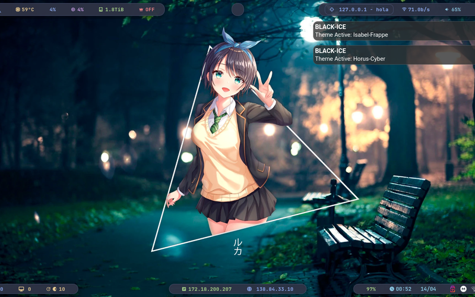 |
| **Emilia-TokyoNight** | **Marisol-Dracula** | **Isabel-Frappe** |
| 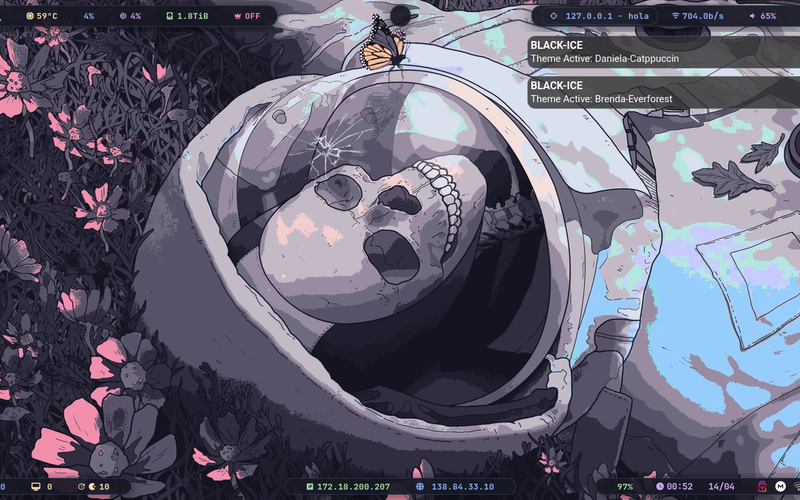 | 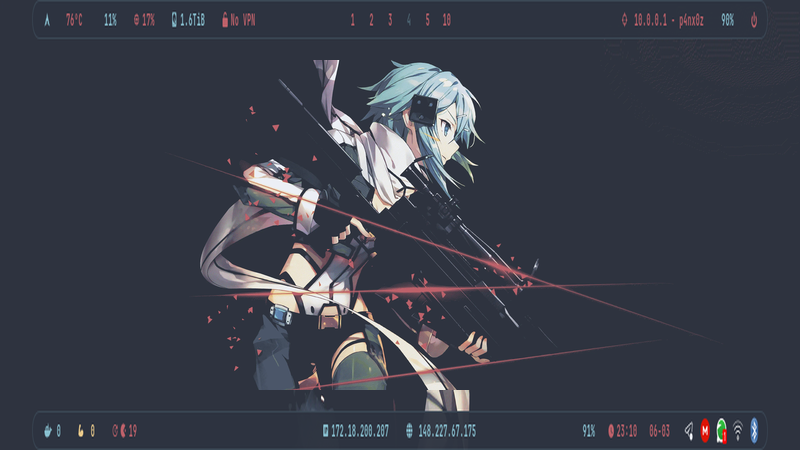 | 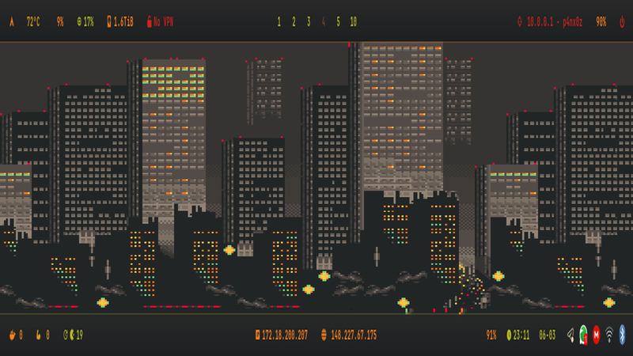 |
| **Daniela-Catppuccin** | **Melissa-Nord** | **Silvia-Gruvbox** |
|  | 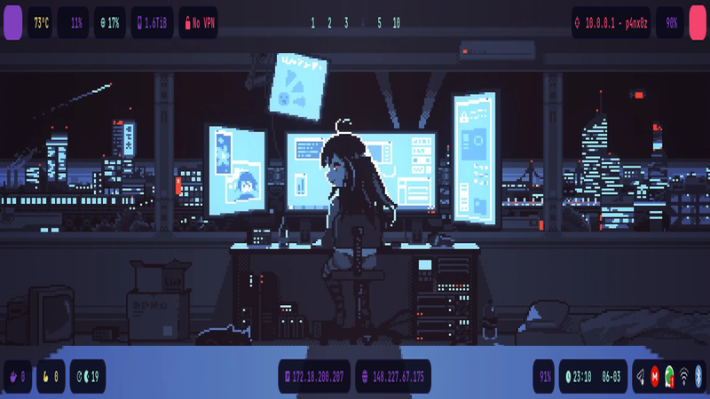 | 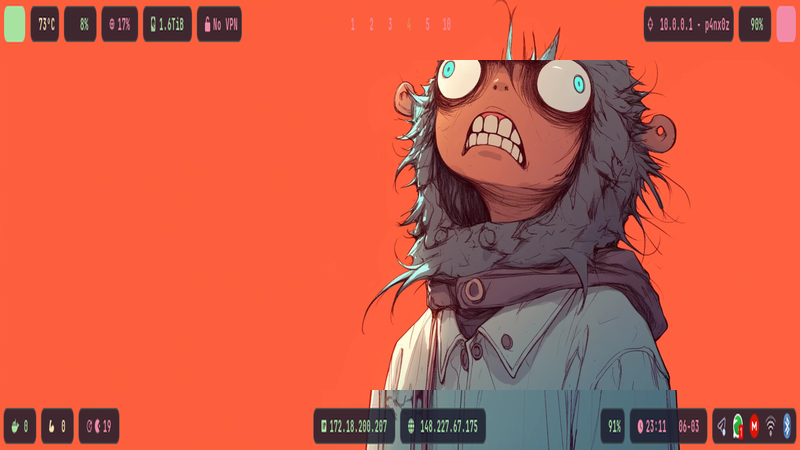 |
| **Brenda-Everforest** | **Karla-ZombieNight** | **Zombie-Decay** |
| 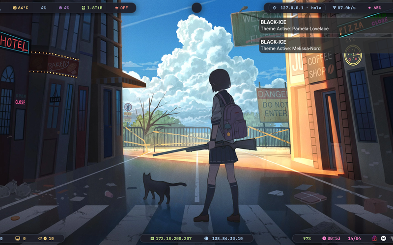 | 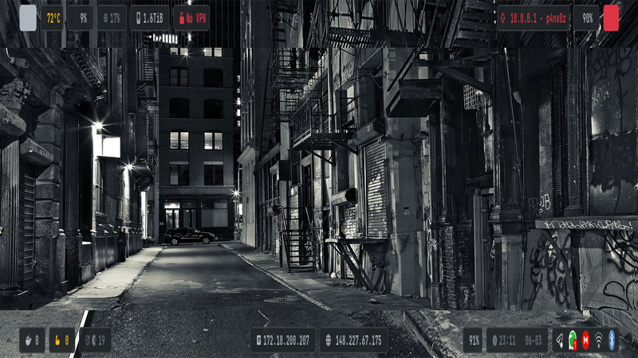 | 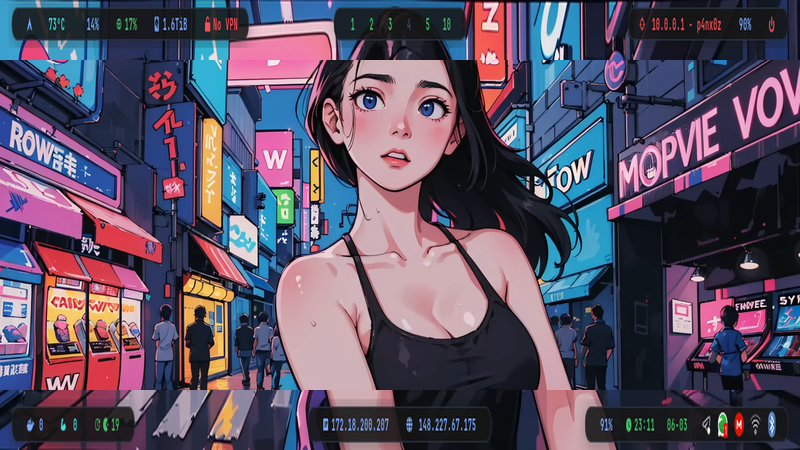 |
| **Pamela-Lovelace** | **Varinka-Mono** | **Yael-OxoCarbon** |
| 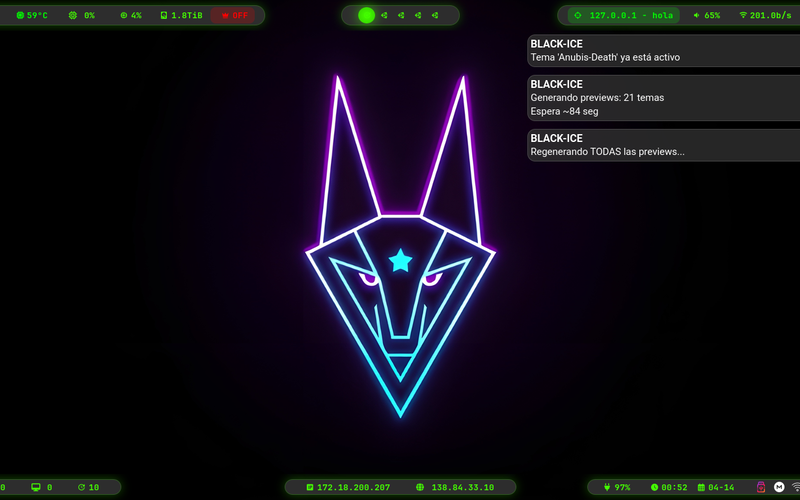 | 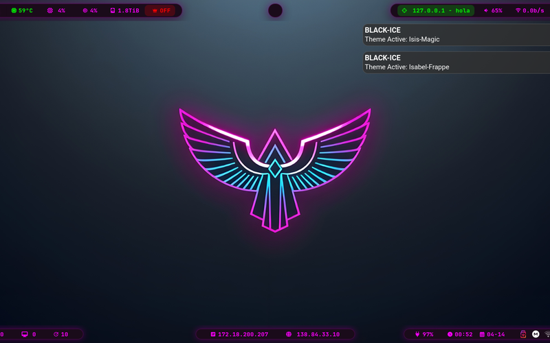 | 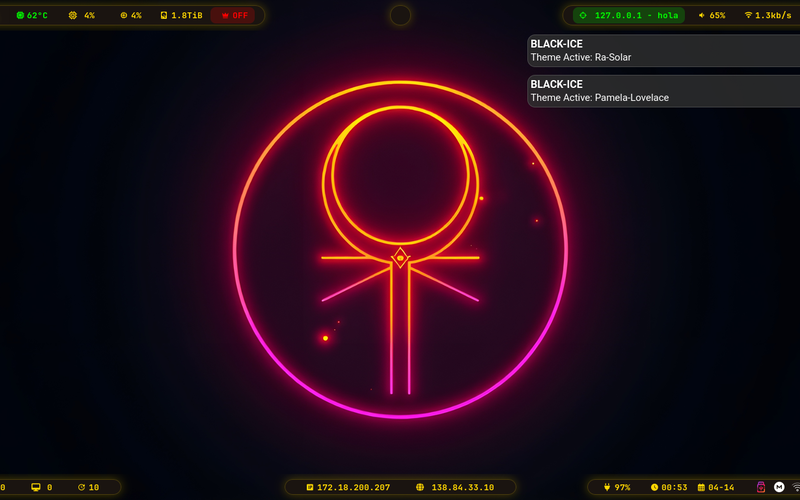 |
| **Anubis-Death** | **Isis-Magic** | **Ra-Solar** |

---

## 💻 System Requirements

| Component | Minimum | Recommended |
|-----------|---------|-------------|
| **CPU** | Dual Core 64-bit | Quad Core+ |
| **RAM** | 4 GB | 16 GB+ |
| **Storage** | 20 GB SSD | 100 GB NVMe |
| **GPU** | Integrated | Dedicated AMD/NVIDIA |
| **Network** | WiFi/Ethernet | Wired Ethernet |
| **Boot mode** | UEFI (recommended) or BIOS | UEFI |

---

## 🚀 Quick Install

### From the Arch Linux LiveCD

```bash
# Option 1: Short URL
curl -L http://is.gd/blackice | bash

# Option 2: Alternative short URL
curl -L https://cutt.ly/blackice | bash

# Option 3: Full URL
curl -L https://raw.githubusercontent.com/panxos/BLACK-ICE-HYPER_ARCH/main/bootstrap.sh | bash
```

The bootstrap script automatically:
1. Checks internet connection and Arch environment
2. Installs git
3. Clones the repository to `/tmp/black-ice-arch`
4. Sets permissions
5. Launches the interactive `install.sh`

---

## 📦 Manual Installation

### Phase 1 — From the LiveCD (as root)

```bash
# Connect to internet (WiFi)
iwctl
station wlan0 connect "YOUR_NETWORK"
exit

# Clone and install
pacman -Sy git
git clone https://github.com/panxos/BLACK-ICE-HYPER_ARCH.git
cd BLACK-ICE-HYPER_ARCH
chmod +x install.sh
./install.sh
```

The installer walks through: disk → LUKS encryption → filesystem → kernel → locale → user → bootloader.

### Phase 2 — After first reboot (as normal user)

```bash
cd BLACK-ICE-HYPER_ARCH
./deploy_hyprland.sh
```

The deploy installs: AUR repositories → Hyprland + desktop → security tools → terminal/shell → themes → optional software → SDDM → Neovim → AI CLIs → dotfiles.

---

## 🔧 Unattended Configuration

Copy `config/install.conf.example` to `config/install.conf` and adjust the variables:

```bash
TARGET_DISK=sda          # Target disk (without /dev/)
ENABLE_LUKS=yes          # LUKS2 full-disk encryption
FILESYSTEM=btrfs         # btrfs | ext4 | xfs | f2fs
KERNEL=linux             # linux | linux-zen | linux-hardened
USERNAME=user            # Username
TIMEZONE=America/Santiago
AUTO_MODE=true           # Skip all interactive prompts
```

---

## ⌨️ Keyboard Shortcuts

### Windows and System

| Shortcut | Action |
|----------|--------|
| `Super + Enter` | Terminal (Kitty) |
| `Super + D` | App launcher (Wofi) |
| `Super + Q` | Close window |
| `Super + M` | Exit Hyprland |
| `Super + L` | Lock screen (Hyprlock) |
| `Super + V` | Toggle floating |
| `Super + F` | Fullscreen |
| `Super + H` | Clipboard (cliphist) |

### Applications

| Shortcut | Action |
|----------|--------|
| `Super + Shift + B` | Brave Browser |
| `Super + Shift + F` | Firefox |
| `Super + E` | Kate Editor |
| `Super + Shift + D` | Dolphin (file manager) |
| `Super + Shift + K` | KeePassXC |
| `Super + Shift + M` | Music Player (ncmpcpp) |
| `Super + Shift + N` | Eww Music Widget toggle |

### BLACK-ICE Tools

| Shortcut | Action |
|----------|--------|
| `Super + I` | Interactive Cheat Sheet (overlay) |
| `Super + Tab` | App Switcher (open windows) |
| `Super + Shift + X` | Pass Menu (KeePassXC CLI) |
| `Super + Ctrl + Enter` | Terminal Manager (multi-tab sessions) |
| `Super + Shift + P` | Power profile menu |

### Customization

| Shortcut | Action |
|----------|--------|
| `Super + Alt + T` | Waybar theme selector (with thumbnails) |
| `Super + Alt + W` | Visual wallpaper selector |
| `Super + Alt + R` | Wofi style selector |
| `Super + Alt + F` | WiFi toggle |

### Screenshots

| Shortcut | Action |
|----------|--------|
| `Print` | Region → Swappy (editor) |
| `Shift + Print` | Fullscreen → clipboard |
| `Super + Print` | Region → `~/Pictures/Screenshots/` |
| `Ctrl + Print` | Fullscreen → `~/Pictures/Screenshots/` |

### Multimedia

| Shortcut | Action |
|----------|--------|
| `F10 / XF86AudioPlay` | Play/Pause (playerctl) |
| `F11 / XF86AudioStop` | Stop |
| `F4 / XF86AudioMicMute` | Mic mute (wpctl, native PipeWire) |
| `XF86AudioRaiseVolume` | Volume up (SwayOSD) |
| `XF86AudioLowerVolume` | Volume down (SwayOSD) |
| `XF86MonBrightnessUp/Down` | Brightness ± (SwayOSD) |

**[Full Keyboard Shortcuts Reference](docs/KEYBOARD_SHORTCUTS.md)**

---

## 🎨 Customization

### Change Waybar Theme

```bash
# Visual selector with thumbnails
Super + Alt + T

# Direct script
~/.local/bin/theme_selector
```

The selector updates in real time: Waybar, Hyprland border, Hyprlock colors and Kitty palette.

### Change Wallpaper

```bash
# Visual waypaper selector
Super + Alt + W

# Direct script
~/.local/bin/wallpaper_visual

# Download gh0stzk wallpapers
~/.local/bin/gh0stzk-walls --all
~/.local/bin/gh0stzk-walls --theme Horus-Cyber
~/.local/bin/gh0stzk-walls --list
```

### Wofi Styles

```bash
Super + Alt + R   # Switch between 4 styles: default, minimal, fullscreen, grid
```

---

## 🔧 Troubleshooting

**Waybar not loading or throwing errors:**
```bash
killall waybar; sleep 1 && waybar &
journalctl --user -u waybar -n 50
```

**paru broken after system update:**
```bash
sudo pacman -Rns paru paru-bin 2>/dev/null
sudo pacman -S paru  # reinstall from chaotic-aur
```

**SDDM not starting:**
```bash
sudo systemctl enable --now sddm
```

**Plymouth not activating at boot:**
```bash
grep "plymouth" /etc/mkinitcpio.conf  # must appear in HOOKS
sudo mkinitcpio -P                     # rebuild initramfs
```

**Wrong keyboard layout at LUKS prompt:**
```bash
cat /etc/vconsole.conf  # verify KEYMAP=<your_layout>
sudo mkinitcpio -P      # rebuild initramfs with correct keymap
```

**Music not playing (MPD):**
```bash
systemctl --user status mpd
systemctl --user enable --now mpd
```

---

## 📁 Repository Structure

```
BLACK-ICE_ARCH/
├── install.sh              # Phase 1 entry point (LiveCD root)
├── deploy_hyprland.sh      # Phase 2 entry point (normal user)
├── bootstrap.sh            # One-liner curl | bash
├── config/
│   └── install.conf.example
├── src/
│   ├── lib/
│   │   ├── colors.sh       # ANSI color variables
│   │   ├── logging.sh      # log_info/warn/error/success, banner
│   │   └── utils.sh        # check_root, retry_command, safe_install
│   ├── modules/            # Phase 1: 00_environment → 99_final
│   └── deploy/             # Phase 2: 00_repositories → 99_finalization
├── dotfiles/
│   ├── hypr/               # hyprland.conf, hyprlock.conf, monitors.conf
│   ├── waybar/             # config.jsonc, style.css, themes/ (21 themes)
│   ├── kitty/              # kitty.conf, themes/ (21 color schemes)
│   ├── wofi/               # config, styles/ (4 styles)
│   ├── swaync/             # config.json, style.css
│   ├── wlogout/            # layout, style.css
│   └── bin/                # Scripts: theme_selector, wallpaper_visual, etc.
├── tests/
│   ├── pre-install-check.sh
│   └── post-install-validate.sh
└── docs/
    ├── ARCHITECTURE.md
    ├── SECURITY.md
    ├── MODULES.md
    ├── TOOLS_CATALOG.md
    ├── KEYBOARD_SHORTCUTS.md
    └── BLACK-ICE_CheatSheet.md
```

---

## 📚 Documentation

| Document | Description |
|----------|-------------|
| **[CHANGELOG.md](CHANGELOG.md)** | Version history |
| **[docs/ARCHITECTURE.md](docs/ARCHITECTURE.md)** | System architecture |
| **[docs/SECURITY.md](docs/SECURITY.md)** | Security analysis and hardening |
| **[docs/MODULES.md](docs/MODULES.md)** | Module documentation |
| **[docs/TOOLS_CATALOG.md](docs/TOOLS_CATALOG.md)** | Complete tools catalog |
| **[docs/KEYBOARD_SHORTCUTS.md](docs/KEYBOARD_SHORTCUTS.md)** | Full keyboard shortcuts reference |
| **[docs/BLACK-ICE_CheatSheet.md](docs/BLACK-ICE_CheatSheet.md)** | Printable cheat sheet |
| **[CREDITS.md](CREDITS.md)** | Credits and acknowledgements |

---

## 🙏 Credits

- **[s4vitar](https://www.youtube.com/@s4vitar)** — Primary inspiration for the workflow philosophy, terminal aesthetics, and professional pentesting setup culture. The `s4vitar-darkness` Waybar theme is a direct tribute to his iconic dual-bar setup.
- **[gh0stzk](https://github.com/gh0stzk/dotfiles)** — Inspiration for Jan-CyberPunk, Emilia-TokyoNight, Marisol-Dracula, and Melissa-Nord themes. The `gh0stzk-walls` script integrates his wallpaper collection with explicit credit.
- **[VandalByte](https://github.com/VandalByte/dedsec-grub2-theme)** — DedSec GRUB2 theme (GPL-3.0).
- [Hyprland](https://hyprland.org/) — Next-generation Wayland compositor.
- [Arch Linux](https://archlinux.org/) — The reference Linux distribution.
- [Sweet Theme](https://github.com/EliverLara/Sweet) — Sweet-Dark GTK theme.

> Full credits: see [CREDITS.md](CREDITS.md)

---

## 🗺️ Roadmap

| Feature | Status | Estimated version |
|---------|--------|-------------------|
| RAM/vCPU detection and adaptive tuning (swappiness, vm.dirty_ratio, zram) | 🔜 Planned | v3.8.0 |
| Graphics protocol detection (SPICE vs VNC) and optimal config per type | 🔜 Planned | v3.8.0 |
| Clevis + Tang support for automatic LUKS unlock over network | 🔜 Planned | v3.8.0 |
| Adaptive power profile based on VM type (low latency vs efficiency) | 💡 Idea | v3.9.0 |
| TUI installation dashboard (ncurses) with real progress bar | 💡 Idea | v3.9.0 |

---

## 📄 License

MIT License — see [LICENSE](LICENSE)

---

## 👤 Author

**Francisco Aravena (P4nX0Z)**

- Cybersecurity Analyst | 15+ years in IT and security
- 🌐 [soporteinfo.net](https://www.soporteinfo.net)
- 💼 [linkedin.com/in/faravena](https://www.linkedin.com/in/faravena/)
- 📺 [youtube.com/@Soporteinfo](https://www.youtube.com/@Soporteinfo)
- 🐙 [github.com/panxos](https://github.com/panxos)

---

<div align="center">

**⭐ If you like this project, give it a star on GitHub ⭐**

**[🇪🇸 Leer en Español](README.md)**

Made with ❤️ for the Cybersecurity Community

</div>
