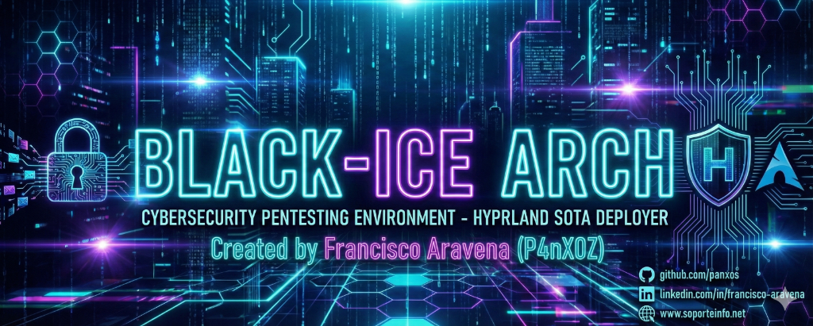
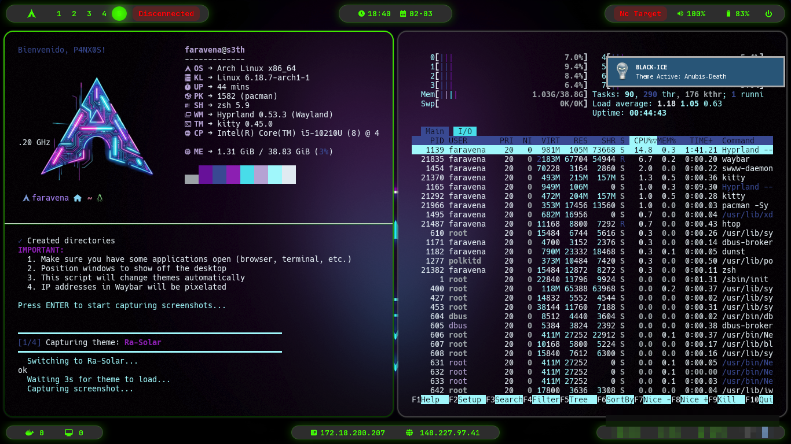
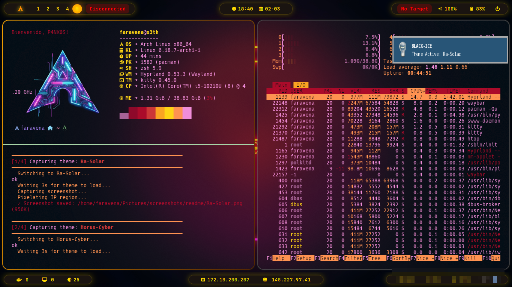
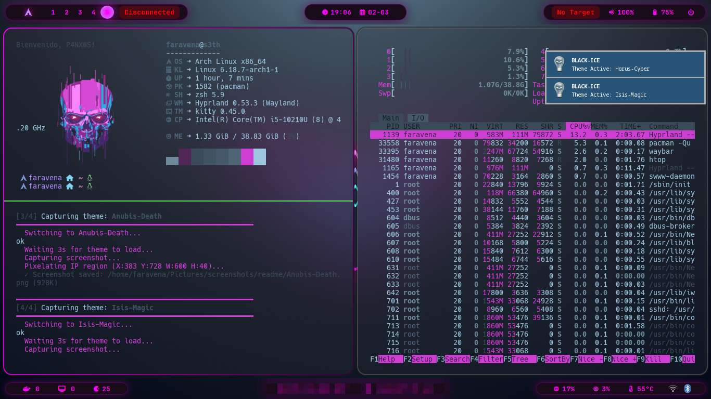

<div align="center">



# 🧊 BLACK-ICE ARCH

### Instalación Automatizada de Arch Linux con Hyprland y Herramientas de Ciberseguridad

[](LICENSE)
[](https://archlinux.org/)
[](https://hyprland.org/)
[](https://github.com/panxos/BLACK-ICE-HYPER_ARCH)

**🇪🇸 Español | [🇬🇧 English](README.en.md)**

---

### 🚀 Instalación en Un Comando

```bash
curl -L http://is.gd/blackice | bash
```

</div>

---

## 📋 Tabla de Contenidos

- [Descripción General](#-descripción-general)
- [Características](#-características)
- [Requisitos](#-requisitos)
- [Instalación Rápida](#-instalación-rápida)
- [Instalación Manual](#-instalación-manual)
- [Herramientas de Seguridad](#-herramientas-de-seguridad)
- [Post-Instalación](#-post-instalación)
- [Atajos de Teclado](#-atajos-de-teclado)
- [Personalización](#-personalización)
- [Solución de Problemas](#-solución-de-problemas)
- [Documentación](#-documentación)
- [Contribuir](#-contribuir)
- [Licencia](#-licencia)

---

## 🎯 Descripción General

**BLACK-ICE ARCH** es un sistema de despliegue automatizado de última generación (SOTA) para Arch Linux, diseñado específicamente para **Profesionales de Ciberseguridad** y **Pentesters**. Transforma una instalación mínima de Arch en un entorno Hyprland completamente configurado, estéticamente impresionante y repleto de funcionalidades.

### ¿Por qué BLACK-ICE ARCH?

- ⚡ **Instalación en un comando** desde el LiveCD
- 🎨 **Estética cyberpunk** con temas personalizados
- 🛡️ **104 herramientas de seguridad** organizadas en 10 categorías
- 🔒 **Enfocado en seguridad** con soporte para cifrado LUKS
- 🚀 **Rendimiento optimizado** con detección de hardware
- 📦 **Totalmente automatizado** instalación y configuración

---

## ✨ Características

### 🎨 Entorno de Escritorio

- **Hyprland** - Compositor Wayland de última generación
  - Animaciones y efectos suaves
  - Soporte multi-workspace
  - Optimizado para rendimiento
  
- **Waybar** - Barra de estado personalizable
  - Módulos con tema cyberpunk
  - Monitoreo del sistema en tiempo real
  - Estado de red y VPN
  
- **SDDM** - Gestor de pantalla con tema cybersec
  - Pantalla de login personalizada
  - Autenticación segura
  - Efectos visuales

### 🛡️ Arsenal de Seguridad

**104 herramientas organizadas en 10 categorías:**

| Categoría | Herramientas | Descripción |
|-----------|--------------|-------------|
| 🔍 **Reconocimiento** | 14 | nmap, masscan, rustscan, recon-ng, amass, sherlock |
| 🌐 **Hacking Web** | 16 | burpsuite, zaproxy, sqlmap, nikto, gobuster, ffuf |
| 📡 **Wireless** | 8 | aircrack-ng, kismet, wifite, reaver, bully |
| 🪟 **Windows/AD** | 10 | impacket, crackmapexec, bloodhound, evil-winrm |
| 🔐 **Cracking** | 10 | john, hashcat, hydra, medusa, rockyou |
| 💥 **Explotación** | 6 | metasploit, armitage, exploitdb, SET |
| 🕵️ **Sniffing** | 9 | wireshark, tcpdump, ettercap, bettercap |
| 🔧 **Ing. Inversa** | 9 | gdb, radare2, ghidra, jadx, apktool |
| 🔬 **Forense** | 12 | autopsy, volatility3, binwalk, steghide |
| 🌐 **Redes** | 10 | proxychains, sshuttle, chisel, socat |

**Instalador interactivo** con:

- Instalación por categorías
- Selección individual de herramientas
- Opción "Instalar Todo"
- Registro de instalación

### 🎨 Tema Cyberpunk

- **Sweet-Dark** Tema GTK
- **Candy Icons** Pack de iconos
- **Kvantum** Motor de temas Qt
- **JetBrains Mono Nerd Font**
- Esquema de colores Cyan/Purple
- Animaciones suaves

### ⚙️ Optimizaciones

- ✅ Detección automática de hardware (Intel/AMD)
- ✅ Soporte de virtualización (VMware, KVM, VirtualBox)
- ✅ Distribución de teclado español
- ✅ Fastfetch con logos aleatorios
- ✅ Scripts de utilidad para pentesting

---

## 🎨 Galería de Temas

BLACK-ICE ARCH incluye **4 temas cyberpunk personalizados** para Hyprland y Waybar. Cambia entre ellos con `Win+Alt+Y`.

| 🌞 Ra-Solar | 🔷 Horus-Cyber |
| :---: | :---: |
|  |  |
| *Tema solar con tonos dorados y amarillos brillantes* | *Tema cibernético con azules neón y efectos futuristas* |

| 💀 Anubis-Death | 🔮 Isis-Magic |
| :---: | :---: |
|  |  |
| *Tema oscuro con verdes lima y estética hacker* | *Tema mágico con púrpuras y magentas vibrantes* |

---

## 💻 Requisitos y Compatibilidad

### Requisitos de Hardware

| Componente | Mínimo | Recomendado |
|------------|--------|-------------|
| **CPU** | Dual Core 64-bit | Quad Core+ |
| **RAM** | 4 GB | 16 GB+ |
| **Almacenamiento** | 20 GB SSD | 100 GB NVMe |
| **GPU** | Integrada | Dedicada AMD/NVIDIA |
| **Red** | WiFi/Ethernet | Ethernet cableado |

### ✅ Plataformas Soportadas

BLACK-ICE ARCH detecta automáticamente tu entorno y aplica optimizaciones específicas:

| Plataforma | Discos | Gráficos | Guest Tools | Estado |
|------------|--------|----------|-------------|--------|
| **Bare Metal** | ✅ SATA/NVMe/MMC | ✅ GPU Nativa | N/A | **Verificado** |
| **KVM/QEMU** | ✅ VirtIO (/dev/vda) | ✅ Auto-Fix | qemu-guest-agent | **Verificado** |
| **Xen** | ✅ Xen (/dev/xvda) | ✅ Auto-Fix | xe-guest-utilities | **Verificado** |
| **VMware** | ✅ SATA/NVMe | ✅ Auto-Fix | open-vm-tools | **Verificado** |
| **VirtualBox** | ✅ SATA | ✅ Auto-Fix | virtualbox-guest-utils | **Verificado** |
| **Hyper-V** | ✅ SCSI/VirtIO | ✅ Auto-Fix | hyperv | **Verificado** |

### Detección Automática

- **CPU**: Instala microcode Intel/AMD automáticamente
- **Virtualización**: Detecta hypervisor e instala guest tools
- **Gráficos VM**: Aplica `WLR_NO_HARDWARE_CURSORS=1` automáticamente
- **Discos**: Soporta SATA, NVMe, VirtIO, Xen, MMC/eMMC

**[📖 Matriz de Compatibilidad Completa](docs/COMPATIBILITY_MATRIX.md)**

---

## 🚀 Instalación Rápida

### Desde Arch Linux LiveCD

**Un comando - ¡eso es todo!**

```bash
# Opción 1: URL corta (is.gd)
curl -L http://is.gd/blackice | bash

# Opción 2: URL corta (cutt.ly)
curl -L https://cutt.ly/blackice | bash

# Opción 3: URL completa
curl -L https://raw.githubusercontent.com/panxos/BLACK-ICE-HYPER_ARCH/main/bootstrap.sh | bash
```

El script bootstrap automáticamente:

1. ✅ Verifica la conexión a Internet
2. ✅ Instala git
3. ✅ Clona el repositorio
4. ✅ Configura permisos
5. ✅ Ejecuta la instalación automáticamente

---

## 📦 Instalación Manual

Si prefieres control manual:

### Paso 1: Arrancar Arch Live ISO

Descarga la ISO oficial de Arch Linux y crea un USB booteable.

### Paso 2: Conectar a Internet

```bash
# Para WiFi
iwctl
station wlan0 connect "TU_RED"
exit

# Para Ethernet
dhcpcd
```

### Paso 3: Clonar Repositorio

```bash
pacman -Sy git
git clone https://github.com/panxos/BLACK-ICE_ARCH.git
cd BLACK-ICE_ARCH
```

### Paso 4: Ejecutar Instalador

```bash
chmod +x install.sh
./install.sh
```

### Paso 5: Post-Instalación

Después de reiniciar en tu nuevo sistema:

```bash
cd BLACK-ICE_ARCH
./deploy_hyprland.sh
```

---

## 🛡️ Herramientas de Seguridad

### Instalador Interactivo

Ejecuta el instalador de herramientas de seguridad:

```bash
sudo ./src/deploy/02_security_tools.sh
```

### Categorías

1. **Reconocimiento y Escaneo** (14 herramientas)
   - Escáneres de red: nmap, masscan, rustscan
   - OSINT: recon-ng, theharvester, spiderfoot, amass
   - DNS: dnsenum, dnsrecon, fierce

2. **Hacking de Aplicaciones Web** (16 herramientas)
   - Proxies: burpsuite, zaproxy
   - Escáneres: sqlmap, nikto, wpscan
   - Fuzzers: gobuster, ffuf, wfuzz, feroxbuster

3. **Wireless y Bluetooth** (8 herramientas)
   - WiFi: aircrack-ng, kismet, wifite
   - Ataques: reaver, bully, pixiewps

4. **Windows y Active Directory** (10 herramientas)
   - Frameworks: impacket, crackmapexec
   - Reconocimiento: bloodhound, neo4j, smbmap

5. **Cracking de Contraseñas** (10 herramientas)
   - Crackers: john, hashcat, ophcrack
   - Fuerza bruta: hydra, medusa
   - Wordlists: seclists, rockyou

6. **Frameworks de Explotación** (6 herramientas)
   - metasploit, armitage, exploitdb
   - social-engineer-toolkit

7. **Sniffing y Spoofing de Red** (9 herramientas)
   - Sniffers: wireshark, tcpdump
   - MITM: ettercap, bettercap, mitmproxy

8. **Ingeniería Inversa** (9 herramientas)
   - Debuggers: gdb, radare2, ghidra
   - Android: apktool, jadx, dex2jar

9. **Forense Digital** (12 herramientas)
   - Análisis: autopsy, volatility3
   - Recuperación: binwalk, foremost, scalpel
   - Esteganografía: stegseek, steghide

10. **Utilidades de Red y Tunneling** (10 herramientas)
    - Tunneling: proxychains, sshuttle, chisel
    - Utilidades: socat, netcat, curl

---

## 🎮 Post-Instalación

### Primer Inicio de Sesión

1. Selecciona la sesión **Hyprland** en SDDM
2. Inicia sesión con tus credenciales
3. ¡Disfruta de tu escritorio cyberpunk!

### Configuración Inicial

```bash
# Actualizar sistema
sudo pacman -Syu

# Instalar herramientas adicionales
sudo ./src/deploy/02_security_tools.sh

# Personalizar tema
~/.config/bin/theme_selector

# Cambiar wallpaper
~/.config/bin/wallpaper_switcher
```

---

## ⌨️ Atajos de Teclado

### Esenciales

| Atajo | Acción |
|-------|--------|
| `Super + Return` | Abrir terminal (Kitty) |
| `Super + D` | Lanzador de aplicaciones (Wofi) |
| `Super + Q` | Cerrar ventana |
| `Super + M` | Salir de Hyprland |
| `Super + L` | Bloquear pantalla |

### Aplicaciones

| Atajo | Acción |
|-------|--------|
| `Super + Shift + B` | Brave Browser |
| `Super + Shift + F` | Firefox |
| `Super + Shift + K` | KeePassXC |
| `Super + E` | Kate Editor |
| `Super + Shift + D` | Dolphin Gestor de Archivos |

### Capturas de Pantalla

| Atajo | Acción |
|-------|--------|
| `Print` | Captura de región |
| `Shift + Print` | Captura de pantalla completa |
| `Super + Print` | Captura de región (guardar) |
| `Ctrl + Print` | Captura completa (guardar) |

### Espacios de Trabajo

| Atajo | Acción |
|-------|--------|
| `Super + 1-5` | Cambiar a workspace 1-5 |
| `Super + Shift + 1-5` | Mover ventana a workspace 1-5 |

### Multimedia

| Atajo | Acción |
|-------|--------|
| `F10` | Reproducir/Pausar |
| `F11` | Detener |
| `XF86AudioRaiseVolume` | Subir volumen |
| `XF86AudioLowerVolume` | Bajar volumen |
| `XF86AudioMute` | Silenciar audio |

**[📖 Cheat Sheet Completo](docs/wiki/es/Atajos-Teclado.md)**

---

## 🎨 Personalización

### Temas

```bash
# Cambiar tema
~/.config/bin/theme_selector

# Temas disponibles:
# - Mecabar-p4nx0z (predeterminado)
# - Cyber-Neon
# - Dark-Matrix
# - Purple-Haze
```

### Wallpapers

```bash
# Cambiar wallpaper
~/.config/bin/wallpaper_switcher

# O usar Super + Alt + W
```

### Logos de Fastfetch

Los logos personalizados se seleccionan aleatoriamente en cada inicio de terminal.

Agregar tus propios logos:

```bash
cp tu-logo.png ~/.config/fastfetch/logos/
```

---

## 🔧 Solución de Problemas

### Problemas de Instalación

**Problema**: Sin conexión a Internet

```bash
# WiFi
iwctl
station wlan0 connect "TU_RED"
exit

# Ethernet
dhcpcd
```

**Problema**: Git no encontrado

```bash
pacman -Sy git
```

### Problemas Post-Instalación

**Problema**: Waybar no carga

```bash
killall waybar
sleep 1 && waybar &
```

**Problema**: Fastfetch muestra ASCII en lugar de imagen

```bash
# Verificar terminal Kitty
echo $TERM
# Debe mostrar: xterm-kitty

# Reinstalar fastfetch
sudo pacman -S fastfetch
```

**Problema**: Apps KDE no usan tema oscuro

```bash
# Reconfigurar temas Qt
cp ~/.config/qt5ct/qt5ct.conf ~/.config/qt5ct/qt5ct.conf.bak
cp dotfiles/qt5ct/qt5ct.conf ~/.config/qt5ct/
cp dotfiles/qt6ct/qt6ct.conf ~/.config/qt6ct/
```

**[📖 Guía Completa de Troubleshooting](docs/wiki/es/Troubleshooting.md)**

---

## 📚 Documentación

### Wiki

- **[🏠 Inicio](docs/wiki/es/Home.md)** - Página principal de la wiki
- **[📦 Instalación](docs/wiki/es/Instalacion.md)** - Guía detallada de instalación
- **[⚙️ Configuración](docs/wiki/es/Configuracion.md)** - Configuración avanzada
- **[🛡️ Herramientas de Seguridad](docs/wiki/es/Herramientas-Seguridad.md)** - Catálogo completo
- **[🎨 Personalización](docs/wiki/es/Personalizacion.md)** - Temas y personalización
- **[⌨️ Atajos de Teclado](docs/wiki/es/Atajos-Teclado.md)** - Cheat sheet completo
- **[🔧 Troubleshooting](docs/wiki/es/Troubleshooting.md)** - Solución de problemas
- **[❓ FAQ](docs/wiki/es/FAQ.md)** - Preguntas frecuentes

### Documentación Técnica

- **[🏗️ Arquitectura](docs/ARCHITECTURE.md)** - Arquitectura del sistema
- **[🔒 Seguridad](docs/SECURITY.md)** - Análisis de seguridad
- **[📦 Módulos](docs/MODULES.md)** - Documentación de módulos
- **[✅ Matriz de Compatibilidad](docs/COMPATIBILITY_MATRIX.md)** - Soporte VM/Hardware
- **[🛡️ Catálogo de Herramientas](docs/TOOLS_CATALOG.md)** - Herramientas de seguridad
- **[⌨️ Atajos de Teclado](docs/KEYBOARD_SHORTCUTS.md)** - Cheat sheet completo
- **[🤝 Contribuir](docs/CONTRIBUTING.md)** - Guía de contribución

---

## 🤝 Contribuir

¡Las contribuciones son bienvenidas! Por favor lee nuestra [Guía de Contribución](docs/CONTRIBUTING.md) para detalles sobre:

- Código de conducta
- Flujo de trabajo de desarrollo
- Estándares de código
- Proceso de pull request

### Inicio Rápido

```bash
# Fork del repositorio
git clone https://github.com/TU_USUARIO/BLACK-ICE_ARCH.git
cd BLACK-ICE_ARCH

# Crear una rama
git checkout -b feature/tu-caracteristica

# Hacer cambios y commit
git add .
git commit -m "Agregar tu característica"

# Push y crear PR
git push origin feature/tu-caracteristica
```

---

## 📄 Licencia

Este proyecto está licenciado bajo la Licencia MIT - ver el archivo [LICENSE](LICENSE) para detalles.

---

## 🙏 Agradecimientos

- [Hyprland](https://hyprland.org/) - Increíble compositor Wayland
- [Arch Linux](https://archlinux.org/) - La mejor distribución Linux
- [Sweet Theme](https://github.com/EliverLara/Sweet) - Hermoso tema GTK
- Comunidad de Arch Linux y r/unixporn

---

## 👤 Autor

**Francisco Aravena (P4nX0Z)**

- Analista de Ciberseguridad
- 15+ años de experiencia en IT y seguridad
- [GitHub](https://github.com/panxos)

---

<div align="center">

**⭐ Si te gusta este proyecto, dale una estrella en GitHub ⭐**

**[🇬🇧 Read in English](README.en.md)**

Hecho con ❤️ para la Comunidad de Ciberseguridad

</div>
