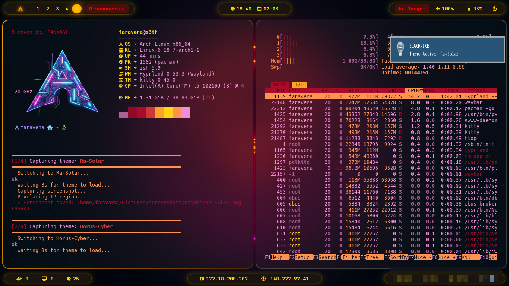
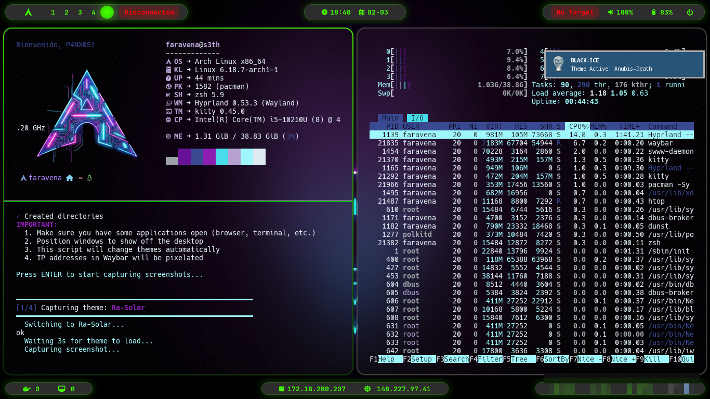
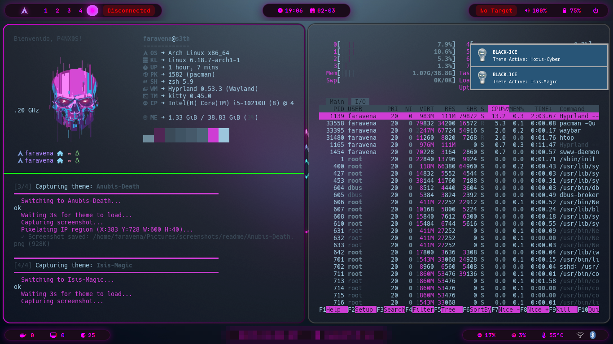
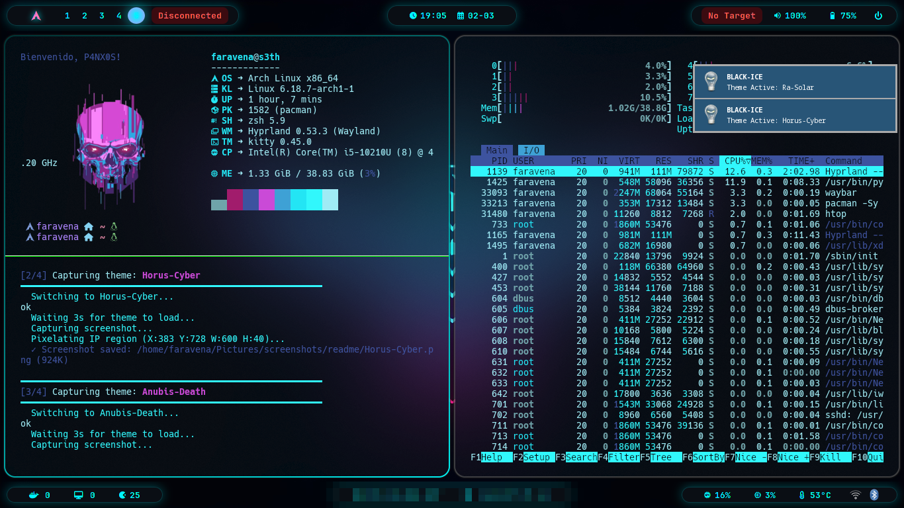

<div align="center">


# 🧊 BLACK-ICE ARCH

### Instalación Automatizada de Arch Linux con Hyprland y Herramientas de Ciberseguridad

[](LICENSE)
[](https://archlinux.org/)
[](https://hyprland.org/)
[](https://github.com/panxos/BLACK-ICE-HYPER_ARCH)

**🇪🇸 Español | [🇬🇧 English](README.en.md)**

---

### 🚀 Instalación en Un Comando

```bash
curl -L http://is.gd/blackice | bash
```

</div>

---

## 📋 Tabla de Contenidos

- [Descripción](#-descripción)
- [Características](#-características)
- [Requisitos](#-requisitos)
- [Instalación Rápida](#-instalación-rápida)
- [Instalación Manual](#-instalación-manual)
- [Herramientas de Seguridad](#-herramientas-de-seguridad)
- [Post-Instalación](#-post-instalación)
- [Atajos de Teclado](#-atajos-de-teclado)
- [Personalización](#-personalización)
- [Solución de Problemas](#-solución-de-problemas)
- [Documentación](#-documentación)
- [Créditos](#-créditos)

---

## 🎯 Descripción

**BLACK-ICE ARCH** es un sistema de despliegue automatizado para Arch Linux, diseñado específicamente para **profesionales de Ciberseguridad** y **Pentesters**. Transforma una instalación mínima de Arch en un entorno Hyprland completamente configurado, estéticamente impactante y listo para auditorías de seguridad.

### ¿Por qué BLACK-ICE ARCH?

- ⚡ **Instalación en un comando** desde la LiveCD
- 🎨 **Estética cyberpunk** con temas personalizados
- 🛡️ **+100 herramientas de seguridad** organizadas en 10 categorías
- 🔒 **Cifrado LUKS** soportado desde la instalación base
- 🚀 **Rendimiento optimizado** con detección automática de hardware
- 📦 **Completamente automatizado** — sin intervención manual

---

## ✨ Características

### 🎨 Entorno de Escritorio

- **Hyprland** — Compositor Wayland de próxima generación con animaciones suaves y soporte multi-workspace
- **Waybar** — Barra de estado customizable con módulos cyberpunk, monitoreo en tiempo real, VPN y batería
- **SDDM** — Gestor de inicio con tema CyberSec personalizado
- **Kitty** — Terminal GPU-acelerado configurado con Powerlevel10k
- **Wofi** — Lanzador de aplicaciones estilo rofi para Wayland
- **SwayNC** — Centro de notificaciones con tema dark

### 🛡️ Arsenal de Seguridad

**+100 herramientas organizadas en 10 categorías:**

| Categoría | Herramientas destacadas |
|-----------|------------------------|
| 🔍 **Reconocimiento** | nmap, masscan, rustscan, theHarvester, sherlock |
| 🌐 **Web Hacking** | burpsuite, zaproxy, sqlmap, nikto, gobuster, ffuf |
| 📡 **Wireless** | aircrack-ng, kismet, wifite, reaver |
| 🪟 **Windows/AD** | impacket, netexec, bloodhound, evil-winrm, certipy |
| 🔐 **Cracking** | john, hashcat, hydra, seclists |
| 💥 **Explotación** | metasploit, searchsploit, villain, SET |
| 🕵️ **Sniffing** | wireshark, tcpdump, ettercap, bettercap |
| 🔧 **Ingeniería Inversa** | gdb, radare2, ghidra, apktool |
| 🔬 **Forense Digital** | autopsy, volatility3, binwalk, exiftool |
| 🌐 **Networking** | proxychains, minicom, cisco-torch, snmpcheck |

**Instalador interactivo whiptail:**
- Suite estándar (recomendada) sin paquetes pesados
- Selección personalizada por checklist
- Paquetes opcionales: bloodhound (~60min), ghidra (~20min), autopsy (~20min)
- Modo desatendido: instala suite estándar sin preguntas

### 🎨 Temas y Apariencia

- **Sweet-Dark** — Tema GTK con variante Ambar-Blue-Dark
- **Candy Icons** — Pack de iconos
- **Kvantum** — Motor de temas Qt/KDE
- **JetBrains Mono Nerd Font**
- **DedSec GRUB2 Theme** — Pantalla de arranque estilo Watch Dogs
- **21 temas Waybar** — seleccionables en vivo con `Win+Alt+T`

---

## 🖼️ Galería de Escritorios

> Cambia entre temas en tiempo real con `Win+Alt+T` (selector visual con thumbnails)

| | | |
|:---:|:---:|:---:|
|  |  |  |
| **Horus-Cyber** | **H4k3r-HTB** | **Matrix-Hacker** |
|  |  |  |
| **Jan-CyberPunk** | **Janis-CyberMagenta** | **s4vitar-darkness** |
|  |  |  |
| **Emilia-TokyoNight** | **Marisol-Dracula** | **Isabel-Frappe** |
|  |  |  |
| **Daniela-Catppuccin** | **Melissa-Nord** | **Silvia-Gruvbox** |
|  |  |  |
| **Brenda-Everforest** | **Karla-ZombieNight** | **Zombie-Decay** |
|  |  |  |
| **Pamela-Lovelace** | **Varinka-Mono** | **Yael-OxoCarbon** |
|  |  |  |
| **Anubis-Death** | **Isis-Magic** | **Ra-Solar** |

---

### 🆕 Novedades v3.3.1

- **Fix crítico Plymouth**: instalado con `--noscriptlet`, evita crash del deploy por hook mkinitcpio prematuro
- **Fix crítico Sweet-Dark**: git clone ya no falla por directorio de trabajo inválido
- **paru desde chaotic-aur**: compilado contra el pacman del sistema, nunca se rompe tras `pacman -Syu`
- **safe_install resiliente**: detecta paru roto y hace fallback automático a pacman
- **Keyboard LUKS/GRUB correcto**: el teclado configurado en Phase 1 se propaga a initramfs, GRUB y Hyprland

---

## 💻 Requisitos

| Componente | Mínimo | Recomendado |
|-----------|--------|-------------|
| **CPU** | Dual Core 64-bit | Quad Core+ |
| **RAM** | 4 GB | 16 GB+ |
| **Almacenamiento** | 20 GB SSD | 100 GB NVMe |
| **GPU** | Integrada | AMD/NVIDIA dedicada |
| **Red** | WiFi/Ethernet | Ethernet cableado |

---

## 🚀 Instalación Rápida

### Desde la LiveCD de Arch Linux

**Un comando y listo:**

```bash
# Opción 1: URL corta (is.gd) — la más fácil
curl -L http://is.gd/blackice | bash

# Opción 2: URL corta (cutt.ly)
curl -L https://cutt.ly/blackice | bash

# Opción 3: URL completa
curl -L https://raw.githubusercontent.com/panxos/BLACK-ICE-HYPER_ARCH/main/bootstrap.sh | bash
```

El bootstrap hace automáticamente:
1. ✅ Verificar conexión a Internet y entorno Arch
2. ✅ Instalar git
3. ✅ Clonar el repositorio
4. ✅ Configurar permisos
5. ✅ Lanzar el instalador interactivo

---

## 📦 Instalación Manual

### Phase 1 — Desde la LiveCD (como root)

```bash
# Conectar a internet (WiFi)
iwctl
station wlan0 connect "TU_RED"
exit

# Clonar e instalar
pacman -Sy git
git clone https://github.com/panxos/BLACK-ICE-HYPER_ARCH.git
cd BLACK-ICE-HYPER_ARCH
chmod +x install.sh
./install.sh
```

### Phase 2 — Después del primer reboot (como usuario normal)

```bash
cd BLACK-ICE-HYPER_ARCH
./deploy_hyprland.sh
```

---

## ⌨️ Atajos de Teclado

### Esenciales

| Atajo | Acción |
|-------|--------|
| `Super + Enter` | Terminal (Kitty) |
| `Super + D` | Lanzador de apps (Wofi) |
| `Super + Q` | Cerrar ventana |
| `Super + M` | Salir de Hyprland |
| `Super + L` | Bloquear pantalla (Hyprlock) |

### Aplicaciones

| Atajo | Acción |
|-------|--------|
| `Super + Shift + B` | Brave Browser |
| `Super + Shift + F` | Firefox |
| `Super + E` | Kate Editor |
| `Super + Shift + D` | Dolphin (gestor de archivos) |

### Personalización

| Atajo | Acción |
|-------|--------|
| `Super + Alt + W` | Selector visual de wallpapers |
| `Super + Alt + T` | Selector de tema Waybar |

**[📖 Cheat Sheet Completo](docs/BLACK-ICE_CheatSheet.md)**

---

## 🎨 Personalización

### Cambiar Tema Waybar

```bash
~/.local/bin/theme_selector
# o desde el atajo: Super + Alt + T
```

### Galería de Wallpapers

<div align="center">

| Horus-Cyber | Ra-Solar |
|:-----------:|:--------:|
|  |  |
| **Isis-Magic** | **Anubis-Death** |
|  |  |

</div>

### Cambiar Wallpaper

```bash
# Selector visual con Wofi
Super + Alt + W

# Script directo
~/.local/bin/wallpaper_switcher

# Descargar wallpapers de gh0stzk
~/.local/bin/gh0stzk-walls --all
```

---

## 🔧 Solución de Problemas

**Waybar no carga o da errores:**
```bash
killall waybar; sleep 1 && waybar &
journalctl --user -u waybar -n 50
```

**paru roto tras actualización del sistema:**
```bash
sudo pacman -Rns paru paru-bin 2>/dev/null
sudo pacman -S paru  # reinstala desde chaotic-aur
```

**SDDM no inicia:**
```bash
sudo systemctl enable --now sddm
```

**Plymouth no activa en el boot:**
```bash
grep "plymouth" /etc/mkinitcpio.conf  # debe aparecer en HOOKS
sudo mkinitcpio -P                     # regenerar initramfs
```

---

## 📚 Documentación

| Documento | Descripción |
|-----------|-------------|
| **[CHANGELOG.md](CHANGELOG.md)** | Historial de versiones |
| **[docs/ARCHITECTURE.md](docs/ARCHITECTURE.md)** | Arquitectura del sistema |
| **[docs/SECURITY.md](docs/SECURITY.md)** | Análisis de seguridad |
| **[docs/MODULES.md](docs/MODULES.md)** | Documentación de módulos |
| **[docs/TOOLS_CATALOG.md](docs/TOOLS_CATALOG.md)** | Catálogo completo de herramientas |
| **[CREDITS.md](CREDITS.md)** | Créditos y agradecimientos |

---

## 🙏 Créditos

- **[s4vitar](https://www.youtube.com/@s4vitar)** — Inspiración principal en workflow, estética de terminal y cultura de pentesting profesional. El tema `s4vitar-darkness` es un tributo directo a su icónico setup de doble barra.
- **[gh0stzk](https://github.com/gh0stzk/dotfiles)** — Inspiración para los temas Jan-CyberPunk, Emilia-TokyoNight, Marisol-Dracula y Melissa-Nord.
- **[VandalByte](https://github.com/VandalByte/dedsec-grub2-theme)** — Tema GRUB2 DedSec (GPL-3.0).
- [Hyprland](https://hyprland.org/) — Compositor Wayland de próxima generación.
- [Arch Linux](https://archlinux.org/) — La mejor distribución Linux.
- [Sweet Theme](https://github.com/EliverLara/Sweet) — Tema GTK hermoso.

> Créditos completos: ver [CREDITS.md](CREDITS.md)

---

## 📄 Licencia

MIT License — ver [LICENSE](LICENSE)

---

## 👤 Autor

**Francisco Aravena (P4nX0Z)**

- Analista de Ciberseguridad | 15+ años en TI y seguridad
- 🌐 [soporteinfo.net](https://www.soporteinfo.net)
- 💼 [linkedin.com/in/faravena](https://www.linkedin.com/in/faravena/)
- 📺 [youtube.com/@Soporteinfo](https://www.youtube.com/@Soporteinfo)
- 🐙 [github.com/panxos](https://github.com/panxos)

---

<div align="center">

**⭐ Si te gusta el proyecto, dale una estrella en GitHub ⭐**

**[🇬🇧 Read in English](README.en.md)**

Hecho con ❤️ para la Comunidad de Ciberseguridad

</div>
