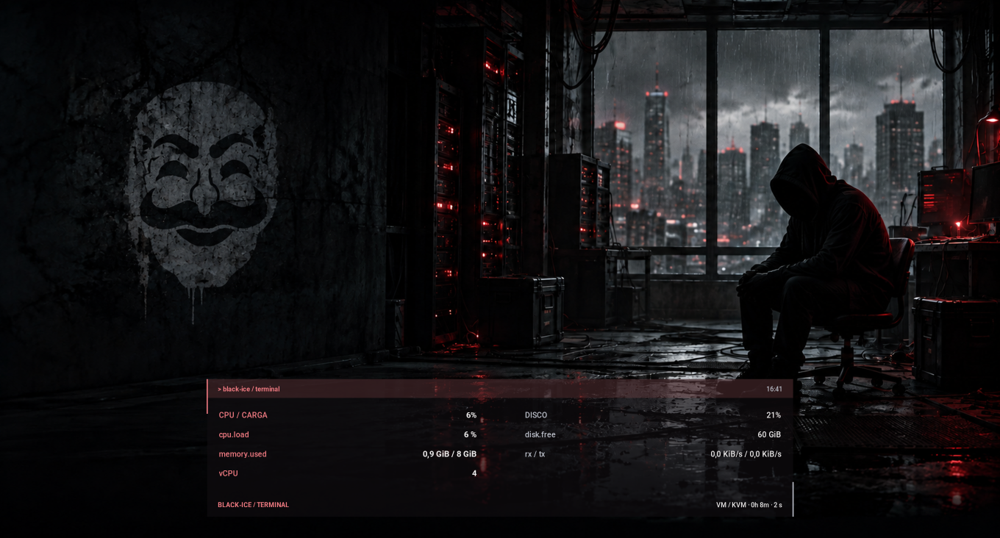
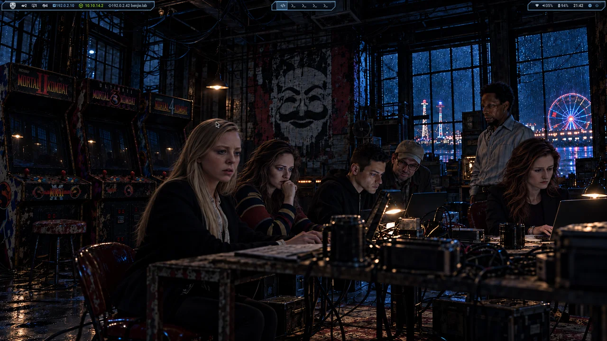
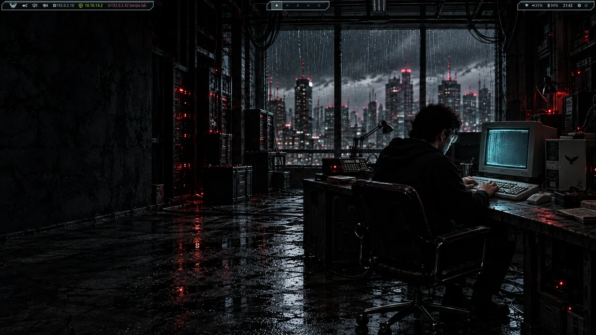
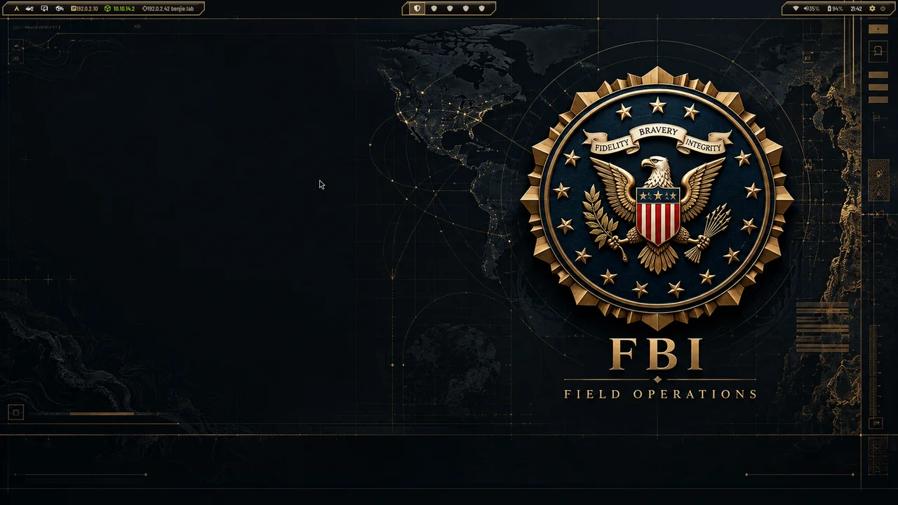
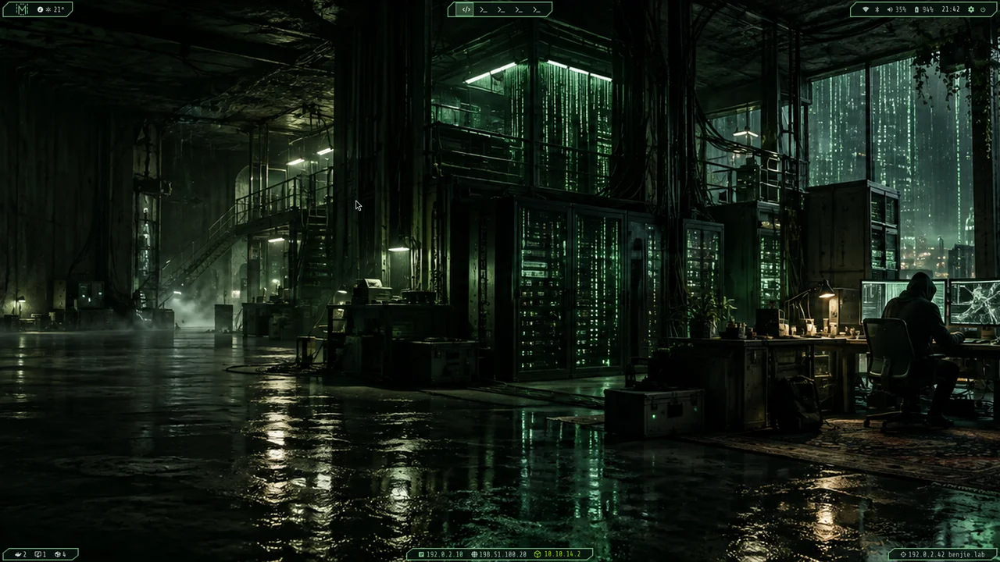
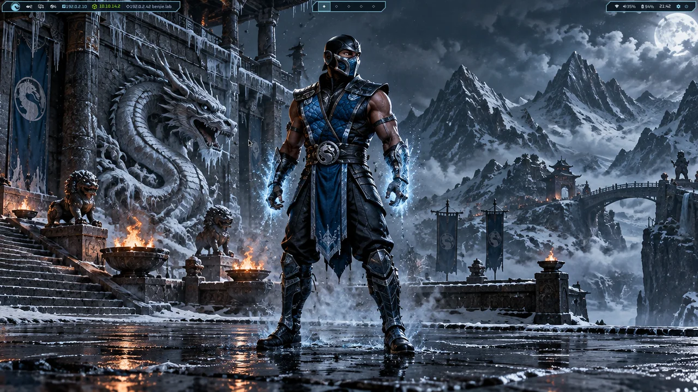
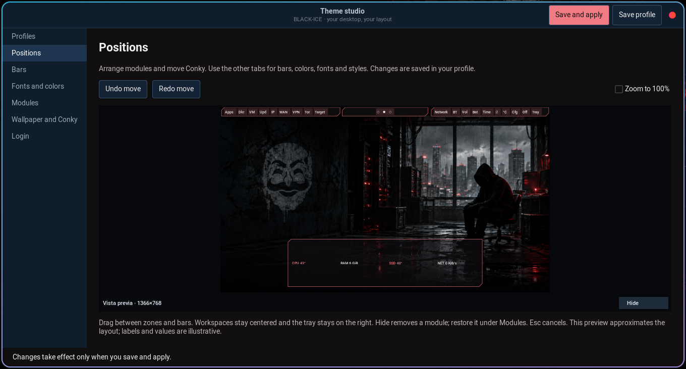

<div align="center">

# BLACK-ICE ARCH

### Arch Linux · Hyprland · Puesto de trabajo para seguridad

**Un escritorio de seguridad con 54 temas, controles propios y herramientas seleccionables.**

[English](README.en.md) · [Instalación](docs/INSTALLER_V4.md) · [Galería](docs/THEMES.md) · [Guía](docs/GUIDE.md) · [Pendientes](docs/PENDING.md)



<sub>Captura real de la VM de validación · Hyprland · tema Mr-Robot</sub>

**4.0.0-dev.2 · candidato en validación · aún sin release**

</div>

BLACK-ICE instala Arch Linux y prepara un escritorio Hyprland con temas, aplicaciones de seguridad y herramientas de administración. Puedes instalar el sistema completo desde una ISO o desplegar el escritorio sobre Arch existente.

Este README describe cambios locales en validación. Clonar la rama remota entrega únicamente lo publicado; no garantiza obtener este candidato.

## Elige tu recorrido

| Quiero… | Empieza aquí |
|---|---|
| Instalar desde un disco vacío | [Instalación](docs/INSTALLER_V4.md) |
| Desplegar el escritorio sobre Arch | [Guía completa](docs/GUIDE.md#instalar-y-reanudar) |
| Personalizar sin perder mis ajustes | [Temas y perfiles](docs/GUIDE.md#temas-y-perfiles) |
| Elegir español o inglés | [Idioma](docs/LANGUAGE.md) |
| Usar mis aplicaciones mediante Tor | [Tor del sistema](docs/SECURITY_WORKSPACE.md#tor-del-sistema) |
| Crear laboratorios o casos | [Seguridad y práctica](docs/GUIDE.md#laboratorios-y-casos) |
| Revisar todo lo que falta | [Pendientes y criterios de cierre](docs/PENDING.md) |

## Un escritorio, muchas identidades

| Mr-Robot | Condor Noir | FBI · Fieldwork |
|---|---|---|
|  |  |  |
| Matrix · Hacker | Civic SI · Mugen | MK11 · SubZero |
|  |  |  |

Cada tema coordina Waybar, Conky, Kitty, lanzador, menús y notificaciones. Los nombres propios permanecen al cambiar de idioma. [Explora los 54 temas](docs/THEMES.md).

<div align="center">

<sub>Theme Studio: organiza módulos, barras y espacios de trabajo; los cambios se aplican solo al guardar.</sub>
</div>

| Componente | Qué puedes hacer |
|---|---|
| Control | Ajustar audio, brillo, red, energía, apariencia y sesión |
| Estudio | Guardar perfiles `User-*`, ordenar módulos y ajustar barras, fuentes y colores |
| Conky | Elegir entre 20 estilos y una, varias o todas las pantallas |
| Lanzador | Cabecera panorámica, lista compacta, mosaicos o Wofi |
| Monitores | Fondos individuales, panoramas por fila o una escena compartida |
| Ayuda F1 | Buscar los bindings realmente cargados por la sesión |

La galería usa capturas Waybar aisladas con datos de demostración. Los temas usan las imágenes fuente y las escalan al mostrarlas; el repositorio no almacena copias reescaladas sin detalle adicional. [Fondos y procedencia](docs/WALLPAPERS.md).

El Estudio es un configurador sencillo. El diseñador universal de Hyprland queda como proyecto independiente futuro. Al aplicar un tema con seguimiento de SDDM, el acceso adopta su paleta y fondo para el próximo inicio de sesión. Guardar un perfil por sí solo no cambia SDDM. Hyprlock también tiene controles propios.

## Español e inglés

**Control → Sistema → Idioma** guarda la elección para los controles del escritorio, independientemente del tema. También puedes usar:

```bash
black-ice-language set es
black-ice-language set en
```

Control, Estudio, galerías y paneles del sistema usan traducciones compartidas. La revisión visual todavía encontró rótulos pendientes en Control y Conky. Los datos que escribes, nombres de perfiles e identificadores conservan su valor. SDDM Obsidiana ofrece una elección propia antes del acceso. Los programas externos gestionan sus traducciones y pueden necesitar reinicio o configuración de locale. [Cobertura y pruebas](docs/LANGUAGE.md).

## Instalar en dos fases

Necesitas acceso a repositorios, hardware compatible con Hyprland y un disco de destino revisado. Usa la ISO oficial de Arch para el sistema base y un usuario normal con sudo para el escritorio.

```bash
git clone https://github.com/panxos/BLACK-ICE-HYPER_ARCH.git BLACK-ICE_ARCH
cd BLACK-ICE_ARCH
```

| Fase | Comando | Resultado |
|---|---|---|
| Base, desde la ISO | `sudo bash install.sh` | Disco, Btrfs/ext4, LUKS opcional, usuario, red y arranque |
| Escritorio, después del reinicio | `bash deploy_hyprland.sh` | Hyprland, aplicaciones elegidas, dotfiles y servicios |

**La fase base puede particionar y formatear el disco elegido.** Revisa [la configuración de ejemplo](config/install.conf.example) y [la guía](docs/INSTALLER_V4.md). La autorización de borrado identifica el disco exacto.

Revisa la selección de software antes de instalar:

```bash
bash deploy_hyprland.sh --dry-run --profile pentest
python3 scripts/select-apps.py --ui auto --output ~/.local/state/black-ice/apps-plan.json
bash deploy_hyprland.sh --dry-run --plan ~/.local/state/black-ice/apps-plan.json
```

Ejecuta el último comando sin `--dry-run` cuando hayas revisado el plan. Hay **143 aplicaciones en 20 grupos** y perfiles `minimal`, `desktop`, `pentest` y `full`. Cancelar omite el software opcional. AUR requiere revisión; no se compila como root.

`install.sh --resume` y `deploy_hyprland.sh --resume` comprueban destino, configuración y resultados. Reanudar no autoriza repetir el particionado. [Instalador](docs/INSTALLER_V4.md) · [Repositorios y autorización](docs/REPOSITORY_RECOVERY.md).

## Tor para tus aplicaciones instaladas

El módulo **○ Tor / ● Tor** es pequeño y hereda la apariencia de cada tema. Un clic solicita activarlo o apagarlo; el clic derecho abre controles. **Control → Sistema → Seguridad** permite apagar Tor y ocultar el indicador. Ocultarlo no detiene la conexión.

Un cliente Tor dedicado y una tabla nftables independiente redirigen las conexiones TCP IPv4 normales y el DNS IPv4. **Puedes usar Kitty, Konsole u otra terminal con tus herramientas instaladas. No necesitas una consola especial ni anteponer proxychains.**

| Mientras Tor está activo | Comportamiento |
|---|---|
| TCP IPv4 local | Redirección transparente mediante Tor |
| DNS IPv4 UDP | Redirección al resolvedor Tor |
| IPv6 y UDP restante, incluido QUIC | Bloqueados |
| Tráfico reenviado por puentes de invitados | Bloqueado |
| Loopback y DHCP IPv4 de broadcast | Excepciones locales explícitas |
| Tor detenido o verificación fallida | El filtro permanece; no vuelve automáticamente a salida directa |

```bash
black-ice-privacy status
black-ice-privacy enable
curl --noproxy '*' https://check.torproject.org/api/ip
black-ice-privacy disable
```

Activar requiere autorización administrativa. El estado activo comprueba reglas, servicio y salida real de una conexión normal. Activar o desactivar Tor no abre ninguna consola especial; usa las terminales y aplicaciones habituales, y apaga Tor desde el mismo control.

Tor no transporta todos los protocolos ni evita que una aplicación revele identificadores, inicios de sesión o características del navegador. No protege ante root comprometido ni sustituye Tor Browser. VPN, videollamadas y herramientas UDP/ICMP/raw pueden dejar de funcionar. [Manual Tor](https://man.archlinux.org/man/tor.1.en) · [Instalación, emergencia y límites](docs/SECURITY_WORKSPACE.md).

## Software, recuperación y práctica

**Control → Sistema** reúne cinco páginas:

- **Software:** selección, origen, cola persistente, errores y reintentos mediante un helper limitado al catálogo.
- **Actualizaciones:** snapshots Btrfs y copia de `/boot`/ESP. Crear un punto no acredita recuperación; hay que restaurarlo offline y arrancar.
- **Proyectos/VPN:** objetivos independientes y UUID de NetworkManager, sin guardar contraseñas en perfiles.
- **Laboratorios:** Alpine, Debian, VM Alpine live, Juice Shop y WebGoat desde fuentes oficiales, con presupuesto agregado.
- **Seguridad:** Tor, forense opcional, alcance de casos, notas privadas, evidencias SHA-256 y resumen saneado.

Las plantillas son offline o publican únicamente en localhost; no montan carpetas personales. La caché se controla durante preparación y no equivale a una cuota física continua. Los vencimientos apagan recursos registrados sin borrar datos. El aislamiento no está validado para malware.

[Guía completa](docs/GUIDE.md) · [Gestores](docs/SYSTEM_MANAGER.md) · [Laboratorios](docs/LABORATORIES.md)

## Atajos para empezar

| Tecla | Acción |
|---|---|
| Super / Super+D | Lanzador |
| Super+Enter | Kitty |
| Super+Alt+T / Super+Alt+W | Apariencia / fondos |
| F1 / Super+I | Ayuda de los atajos activos |
| Super+1…5 | Escritorio local del monitor enfocado |
| Super+Alt+1…5 | Enviar ventana al escritorio local |
| Super+F8 / Super+Shift+F8 | Conky / galería Conky |
| Super+L | Bloquear |

Los bindings personales pueden variar. [Referencia de teclas](docs/KEYBOARD_SHORTCUTS.md).

## Actualizar y revertir

Usa el comando único para recibir mejoras de BLACK-ICE sin reinstalar ni actualizar los paquetes de Arch:

```bash
black-ice-update --dry-run
black-ice-update
```

El comando actualiza el checkout con `git pull --ff-only`, migra dotfiles de forma conservadora, instala controles de usuario y pide `sudo` para refrescar los componentes de sistema incluidos. Revisa primero la simulación. Si el checkout tiene cambios locales, se detiene; revísalos y usa `black-ice-update --no-pull` cuando quieras aplicar desde esa copia. No ejecuta `pacman -Syu`, no vuelve a desplegar Hyprland y no activa Tor. [Alcance y pasos](docs/SECURITY_WORKSPACE.md#actualizar-black-ice).

## Estado de validación

La instalación limpia comprobada en VM usa UEFI/Btrfs/LUKS y el perfil `minimal`, desde ISO de Arch y repositorio oficial; SDDM, Hyprland y la persistencia del tema tras reiniciar iniciaron correctamente. La CI de `main` pasó 347 pruebas. Tor del sistema comprobó conexión normal, DNS, caída, bloqueo UDP/IPv6 y tráfico reenviado, apagado y recuperación de conectividad.

Siguen abiertos la actualización coordinada de todos los componentes entre versiones, BIOS/ext4, fallos dentro de transacciones, pruebas físicas de pantallas/energía/USB, rendimiento comparable, licencia y redistribución de recursos. La CI remota está aprobada. **No hay release hasta cerrar los bloqueos.**

[Todos los pendientes](docs/PENDING.md) · [Validación](docs/AUDIT_REPORT.md) · [Roadmap](docs/ROADMAP_SYSTEM_V4.md)

## Desarrollo

```bash
bash scripts/check-project.sh
python3 scripts/check-distribution.py
```

| Ruta | Responsabilidad |
|---|---|
| `src/modules/`, `src/deploy/` | Instalación base y escritorio |
| `src/lib/`, `src/system/` | Utilidades y gestores |
| `dotfiles/` | Escritorio, controles y servicios |
| `config/` | Aplicaciones, idiomas, energía, Tor y exclusiones |
| `assets/` | Fondos, fuentes, iconos y accesos |
| `scripts/`, `tests/` | Generación y validación |
| `docs/` | Guías, galería y estado |

[Arquitectura](docs/ARCHITECTURE.md) · [Contribuir](docs/CONTRIBUTING.md) · [Cambios](CHANGELOG.md)

## Autoría y recursos

**Francisco Aravena · P4NX0Z** · [soporteinfo.net](https://soporteinfo.net)

[Créditos y procedencia](CREDITS.md). Los componentes externos conservan licencias y marcas. La licencia general y permisos pendientes de redistribución deben resolverse antes de publicar el candidato. Configuraciones privadas, contraseñas, registros y evidencias quedan excluidos de Git y de la distribución.
