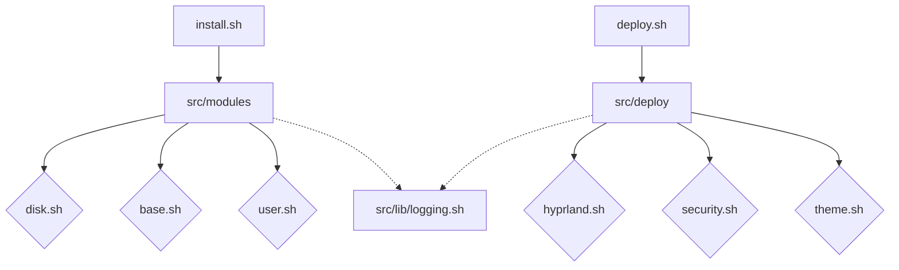

# 🏗️ Architecture Architecture

## System Overview

BLACK-ICE ARCH follows a **Modular Layered Architecture**.
It separates the "Base System" installation from the "User Environment" deployment.

### 1. Layers

- **Layer 0: Bootstrapping** (`scripts/install.sh`)
  - Handles disk partitioning (LUKS/LVM/Bratfs).
  - Installs base packages (`pacstrap`).
  - Configures bootloader (GRUB).
  - Creates the unprivileged user.

- **Layer 1: Environment Deployment** (`scripts/deploy.sh`)
  - Executed by the user *inside* the new system.
  - Deploys Hyprland compositor.
  - Installs user-land tools (Browsers, Terminals).
  - Configures Dotfiles symlinks.

- **Layer 2: Pentesting Suite**
  - Integrates BlackArch repositories.
  - Installs category-based tools (Web, Wireless, Forensics).

### 2. Dependency Graph

### 3. Design Principles

- **Idempotency**: Modules check for existing state before acting.
- **Isolation**: Each module is self-contained (mostly).
- **Strict Mode**: Scripts run with `set -uo pipefail` to prevent silent failures.
- **Separation of Concerns**: Install scripts = System level; Deploy scripts = User level.
