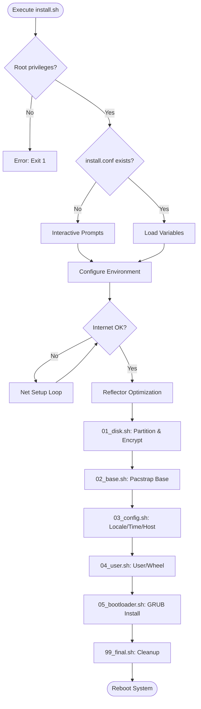
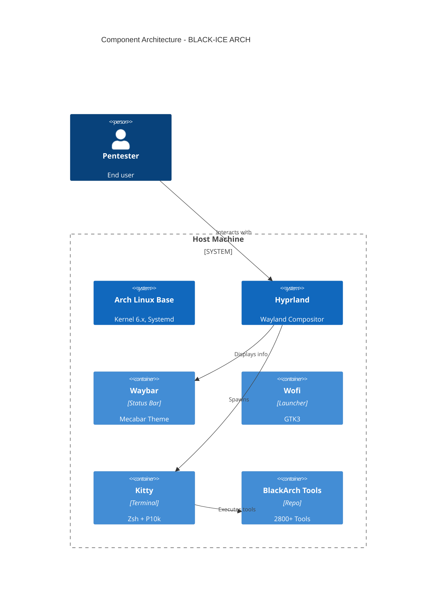

# 📊 System Diagrams

## 1. Installation Flowchart

```mermaid
graph TD
    Start([Execute install.sh]) --> RootCheck{Root privileges?}
    RootCheck -- No --> Exit[Error: Exit 1]
    RootCheck -- Yes --> DetectConf{install.conf exists?}
    
    DetectConf -- Yes --> LoadConf[Load Variables]
    DetectConf -- No --> Interact[Interactive Prompts]
    
    Interact --> ConfigEnv
    LoadConf --> ConfigEnv[Configure Environment]
    
    ConfigEnv --> NetCheck{Internet OK?}
    NetCheck -- No --> Wifi[Net Setup Loop]
    Wifi --> NetCheck
    NetCheck -- Yes --> Mirrors[Reflector Optimization]
    
    Mirrors --> DiskPart[01_disk.sh: Partition & Encrypt]
    DiskPart --> BaseInst[02_base.sh: Pacstrap Base]
    BaseInst --> SysConf[03_config.sh: Locale/Time/Host]
    SysConf --> UserSetup[04_user.sh: User/Wheel]
    UserSetup --> Grub[05_bootloader.sh: GRUB Install]
    Grub --> Finalize[99_final.sh: Cleanup]
    
    Finalize --> Reboot([Reboot System])
```

## 2. Component Architecture

```mermaid
C4Context
    title Component Architecture - BLACK-ICE ARCH
    
    Person(user, "Pentester", "End user")
    System_Boundary(s1, "Host Machine") {
        System(arch, "Arch Linux Base", "Kernel 6.x, Systemd")
        System(hypr, "Hyprland", "Wayland Compositor")
        
        Container(waybar, "Waybar", "Status Bar", "Mecabar Theme")
        Container(wofi, "Wofi", "Launcher", "GTK3")
        Container(kitty, "Kitty", "Terminal", "Zsh + P10k")
        Container(blackarch, "BlackArch Tools", "Repo", "2800+ Tools")
        
        Rel(user, hypr, "Interacts with")
        Rel(hypr, waybar, "Displays info")
        Rel(hypr, kitty, "Spawns")
        Rel(kitty, blackarch, "Executes tools")
    }
```
